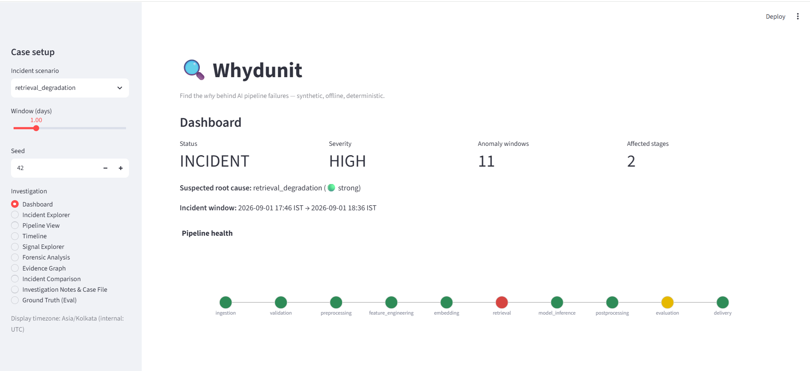
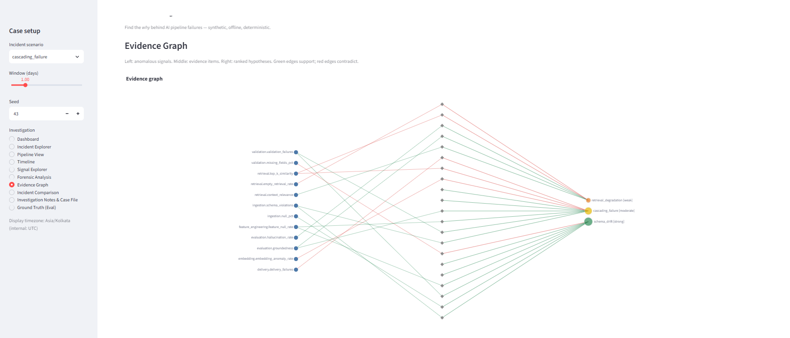

# 🔍 Whydunit

**Find the *why* behind AI pipeline failures.**



Your LLM just returned a garbage answer at 10:42. Was the model at fault?
Or did the real failure start at 10:19 — three stages upstream, in a
schema change your dashboards happily graphed without connecting to
anything? Monitoring tells you *that* something broke. Whydunit is a
forensic investigation console that helps you reconstruct *why*:
timeline, correlated signals, dependency-aware upstream reasoning, and
ranked root-cause hypotheses that carry their supporting **and**
contradicting evidence.

The core is fully synthetic, fully offline, fully deterministic: no API
keys, no cloud credentials, no external services. Clone it, run it,
break the pipeline on purpose, and investigate. The one optional
exception is the v0.2 **AI narrative layer** — an LLM that explains the
engine's evidence under strict citation validation, and never generates
it (see below).

## The problem

AI pipelines fail stages away from where the failure surfaces. A bad
index build degrades retrieval; thin context makes the LLM hallucinate;
evaluation scores tank — and the on-call engineer stares at the model,
which is innocent. Per-metric dashboards show ten unconnected charts
turning red in sequence. What an engineer actually needs in that moment
is an investigator: *what moved first, what moved together, what upstream
fault can explain all of it, and what should I check next?*

## What the engine does

Deterministic forensic chain — no ML theatre, no LLM in the loop:

1. **Anomaly detection** — rolling robust z-score (shifted median/MAD)
   for breaks, EWMA residuals for slow drift, merged into windows
2. **Change-point detection** — two-window mean-shift scan: *when* did
   the level shift begin
3. **Cross-signal correlation** — which signals moved together, and who
   moved first
4. **Dependency reasoning** — a stage DAG answers "can one fault at X
   explain everything downstream?"
5. **Hypothesis ranking** — rule-based fault signatures scored with
   documented weights, producing evidence-backed candidates with
   qualitative confidence bands and a concrete next investigation step

And because the simulator records a hidden answer key, **the engine is
graded, not trusted**:

| Scenario | Top-1 prediction | Outcome | Detection delay |
|---|---|---|---|
| normal | normal | correct | — |
| schema_drift | schema_drift | correct | 17 min |
| data_quality_degradation | data_quality_degradation | correct | 14 min |
| feature_drift | feature_drift | correct | 37 min |
| retrieval_degradation | retrieval_degradation | correct | 16 min |
| llm_latency_spike | llm_latency_spike | correct | 19 min |
| model_regression | model_regression | correct | 27 min |
| prompt_regression | prompt_regression | correct | 21 min |
| api_rate_limiting | api_rate_limiting | correct | 10 min |
| resource_exhaustion | resource_exhaustion | correct | 10 min |
| cascading_failure | cascading_failure | correct | 17 min |
| multi_factor | both faults surfaced | correct | 16 min |

*Reference configuration: 1 day at 1-minute telemetry, seed 42. Zero
false positives, zero false negatives. Reproduce it yourself:
`python -m whydunit.evaluation` — then challenge it with `--seed`. The
honest limitations of these numbers are spelled out in
[docs/forensic-methodology.md](docs/forensic-methodology.md).*

## Quickstart

Requires Python 3.12+ and [uv](https://docs.astral.sh/uv/) (plain
`pip install -e .` works too).

**Linux / macOS**

```bash
git clone https://github.com/bdeva1975/whydunit.git
cd whydunit
uv sync
uv run streamlit run app.py
```

**Windows (PowerShell)**

```powershell
git clone https://github.com/bdeva1975/whydunit.git
cd whydunit
uv sync
uv run streamlit run app.py
```

The console opens at `http://localhost:8501`. Pick an incident scenario
in the sidebar and investigate.

Generate datasets from the CLI:

```bash
uv run python -m whydunit.simulator --scenario retrieval_degradation --days 7 --frequency 1min --seed 42 --output data/
```

Run the test suite and the engine's report card:

```bash
uv run pytest -q
uv run python -m whydunit.evaluation
```

## An example investigation

Load `retrieval_degradation` (the default) and walk the console:

1. **Dashboard** — INCIDENT / HIGH; pipeline strip shows `retrieval`
   red, `evaluation` yellow, everything else green
2. **Timeline** — `retrieval.top_k_similarity` breaks first at 17:46
   IST; anomaly shading and a dotted level-shift marker at onset
3. **Forensic Analysis** — one correlated cluster of five signals;
   first-anomaly ordering reads `top_k_similarity` →
   `context_relevance` → `empty_retrieval_rate` → `groundedness` →
   `hallucination_rate`: the propagation story in one line
4. **Evidence Graph** — signals → evidence → hypotheses, drawn;
   `retrieval_degradation [strong]`, score 9.0, seven supporting items,
   zero contradicting
5. **Case File** — export the whole investigation as Markdown/JSON, with
   your notes, ready for the incident channel

The LLM's hallucinations were a symptom. The index build was the story.



## The AI narrative layer (optional, v0.2)

The engine's findings, told as prose — by an LLM with **zero
authority**. The model is shown only the leading hypothesis and its
evidence, with stable IDs, and must cite an ID for every claim. A
deterministic validator parses the citations back out and rejects the
narrative if it cites an unknown ID or makes an uncited claim: one
corrective retry, then refusal. The engine's ranking of alternative
hypotheses is appended by code, labelled machine-written — the model
never sees them, so it cannot misstate them.

```bash
uv sync --extra llm
export ANTHROPIC_API_KEY=...   # PowerShell: $env:ANTHROPIC_API_KEY="..."
uv run python -m whydunit.explain --scenario retrieval_degradation --seed 42
```

Also available as the "AI narrative report" panel on the console's
Notes & Case File page. The core stays LLM-free: a plain `uv sync`
installs no SDK, CI runs without a key, and the explain-layer tests use
a stubbed client. Design, validation rules, and the refusals that
shaped it: [docs/narrative-layer.md](docs/narrative-layer.md).

## The pipeline

```text
ingestion → validation → preprocessing → feature_engineering → embedding
   → retrieval → model_inference → postprocessing → evaluation → delivery
```

Ten stages, 35 signals, realistic baselines with diurnal seasonality,
and twelve injectable incident scenarios from schema drift to cascading
and multi-factor failures — each a set of σ-scaled effects with onset
delays and ramps, so downstream symptoms genuinely start later. Full
fingerprints and remediation notes: [docs/scenarios.md](docs/scenarios.md).

## Architecture

```text
simulator ──▶ TelemetrySource ──▶ forensic engine ──▶ console / case file
    │            (Protocol)        (never sees               ▲
    └────────── ground truth ────▶ ground truth)             │
                     └───────────▶ evaluation harness ───────┘
```

The ground-truth firewall is enforced by a test that scans the forensic
package's source. The `TelemetrySource` Protocol is the seam where real
telemetry (OpenTelemetry, Prometheus, Langfuse, CSV exports…) replaces
the simulator — `CSVTelemetrySource` already proves the round trip.
Details and design trade-offs: [docs/architecture.md](docs/architecture.md).

A hard architectural principle, implemented in v0.2's narrative layer:
the LLM explains the deterministic engine's structured evidence — it
never generates evidence or diagnoses, and a citation validator enforces
that boundary on every narrative.

## Technology

Python 3.12+ · Streamlit · Pandas · NumPy · Plotly · networkx ·
scikit-learn ecosystem (SciPy) · pytest · ruff · uv. Optional `llm`
extra: the Anthropic SDK for the narrative layer. The core needs no API
keys, no network calls, no secrets.

## Security & privacy

Everything is synthetic; the repository needs and contains no
credentials. The optional narrative layer reads `ANTHROPIC_API_KEY`
from the environment only — never from config files in this repo.
Before pointing a future `TelemetrySource` at real systems: telemetry
can carry PII and prompt content — sanitise at the source boundary,
keep credentials in your secret manager, and treat exported case files
(and generated narratives) as incident-sensitive documents.

## Roadmap

- **v0.3** — variance-changing and partial-recovery incidents;
  per-signal detector overrides; case-file import/replay; seed-sweep
  evaluation with variance bars
- **v0.4** — `OpenTelemetrySource` + `PrometheusSource`; branching
  pipeline demo
- **v1.0** — real-time streaming investigation; collaborative
  investigations

## Contributing

Issues and PRs welcome. Ground rules: `uv run ruff check .` and
`uv run pytest -q` must pass; new scenarios ship with a matching
signature and are validated by `python -m whydunit.evaluation`; the
ground-truth firewall and the narrative citation validator are
non-negotiable. See [docs/scenarios.md](docs/scenarios.md) for the
add-a-scenario walkthrough.

## License

MIT — see [LICENSE](LICENSE).
