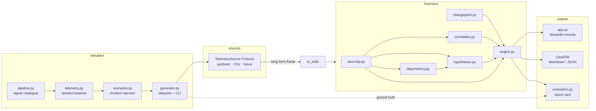
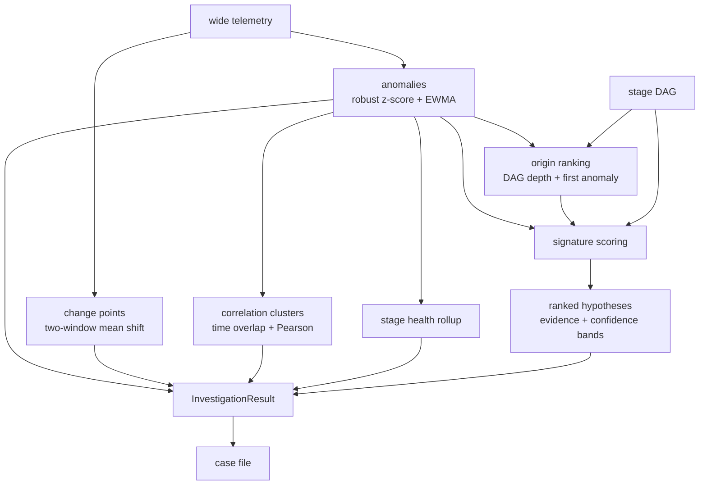

# Whydunit — Architecture

Whydunit is a forensic investigation console for AI pipeline failures. It is
deliberately split into five packages with one-way dependencies, so that the
synthetic data layer can be replaced by real telemetry without touching the
forensic engine.

## Component overview



The dotted edge is the only path ground truth ever travels: from the
generator to the evaluation harness. Nothing under `whydunit.forensics`
imports or mentions it — `tests/test_engine.py` enforces this by scanning
the package source.

## Data flow

1. **Generate.** `simulator.generator.generate_dataset` builds seeded
   baseline telemetry (long form: `timestamp` tz-aware UTC, `stage`,
   `metric`, `value`) and injects one scenario's effects. Effects are
   additive shifts in units of each signal's own noise σ, with onset
   delays and ramps, so downstream symptoms genuinely start later.
2. **Load.** Any `TelemetrySource` yields the same long-form frame;
   `to_wide` pivots it to one `stage.metric` column per signal.
3. **Investigate.** `forensics.engine.investigate` runs the chain:
   anomaly detection → change-point detection → correlation clustering →
   stage-health rollup → hypothesis ranking, returning one immutable
   `InvestigationResult`.
4. **Present.** The Streamlit console renders the result; `case_file`
   exports it; `evaluation.run_evaluation` grades it against ground truth.

## Forensic reasoning flow



Each layer is a pure function over the previous ones. Findings carry their
epistemic status (`observed` / `derived` / `correlation`), and hypotheses
carry both supporting and contradicting evidence with qualitative
confidence bands — never probabilities, because synthetic telemetry cannot
prove causality.

## Package layout

```text
src/whydunit/
├── models/       frozen dataclasses + StrEnums shared by everything
├── simulator/    signal catalogue, baseline generator, incident engine, CLI
├── sources/      TelemetrySource Protocol; synthetic + CSV implementations
├── forensics/    the deterministic engine (never sees ground truth)
├── viz/          pure Plotly figure builders (no Streamlit imports)
└── evaluation.py the one consumer of ground truth
app.py            Streamlit console
```

Dependency direction: `models` ← everything; `simulator` and `forensics`
never import each other's internals (the engine consumes frames, not
simulator objects); `viz` imports `forensics` results but not vice versa;
`app.py` and `evaluation.py` sit on top.

## Key design decisions

| Decision | Choice | Trade-off accepted |
|---|---|---|
| Telemetry shape | Long form canonical, pivot to wide for analysis | Pivot cost is negligible at demo scale; the long form keeps the source Protocol trivial |
| Anomaly detection | Rolling robust z-score (shifted median/MAD) + EWMA residual | No learned models: transparent and deterministic beats marginally better recall |
| Change points | Hand-rolled two-window mean-shift scan | No `ruptures` dependency; weak on very gradual drift (EWMA owns that case) |
| Dependency graph | `networkx` DAG from declared edges | One extra dependency for correct traversal + future branching pipelines |
| Hypotheses | Rule-based signature scoring with documented weights | No ML: every ranking is explainable in a sentence and testable against ground truth |
| Layouts | Deterministic (topological / layered), never spring layouts | Reproducible screenshots and demos |
| Time | UTC internal everywhere; display timezone (IST default) applied at render | Naive/aware mixing bugs eliminated at the boundary |
| Determinism | Single seeded RNG; envelopes are pure functions of timestamps | Identical inputs give identical datasets, investigations, and eval results |

## Extensibility

- **Real telemetry**: implement `TelemetrySource.load()` returning the
  four-column long frame, map your metric names onto the `stage.metric`
  catalogue in `simulator/pipeline.py` (or extend the catalogue), and the
  entire engine and UI work unchanged. `CSVTelemetrySource` is the working
  proof.
- **New scenarios**: add a builder in `simulator/scenarios.py` and a
  matching `Signature` in `forensics/hypotheses.py`; the eval harness picks
  the category up automatically.
- **Branching pipelines**: edit `PIPELINE_EDGES` only — dependency
  reasoning and the pipeline view already treat it as a general DAG.
- **Optional LLM explanation layer** (future, deliberately out of v0.1):
  the deterministic engine produces structured evidence first; an LLM, if
  ever added, explains that evidence — it never generates evidence or
  diagnoses. This ordering is a hard architectural principle.